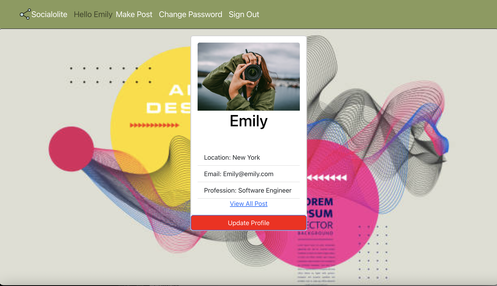
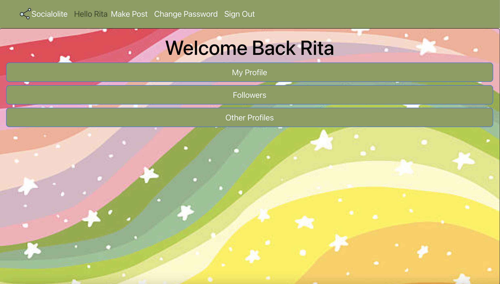
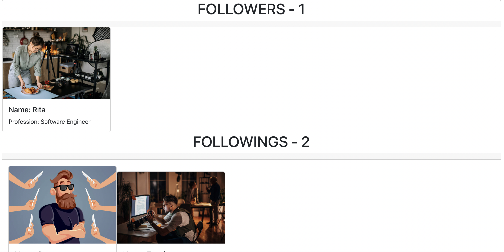
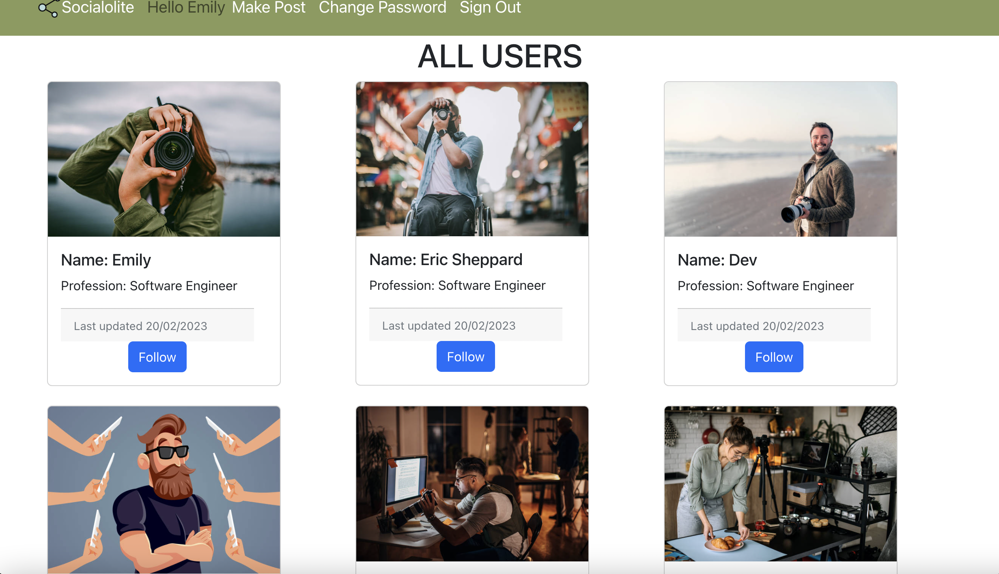
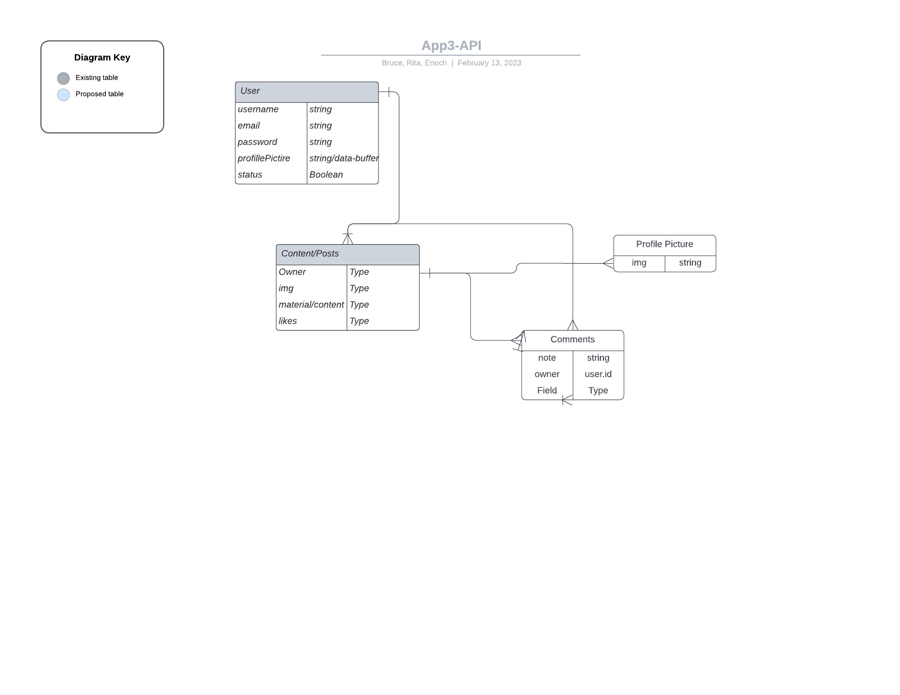

 Helo
=======
# SOCIAL MEDIA APP
##### HEAD

# User Story
- This is a Social Media Application
=======
BRE-Crypt
By; Rita, Enoch, and Bruce

Welcome to the GenZ era of Social Media. 
Our Social media app facilitates users to do the following on our website:

- Sign-Up
- Log-In
- Log-Out
- Show Online or Offline

- Create Post/Content
- Update/Delete Content
- Follow
- Unfollow

BONUS

- Comments on Profile Picture
- Chat-Bot

# Technologies Used

1. HTML5
2. CSS
3. Java Script
4. Node and it's packages
5. Mongoose/MongoDB
6. Express
7. React

# Wireframes

## USER Screens

(1) User Profile

(2) User Dashboard

(3) Followers & Followings

(4) All User Profiles

# Models - ERD

